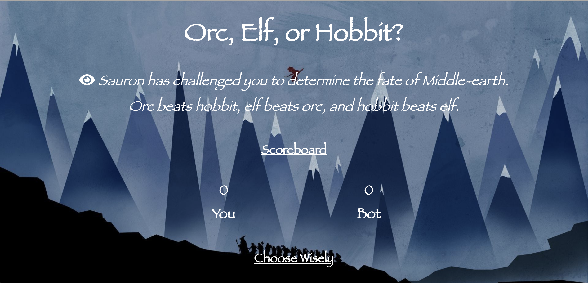

# Rock Paper Scissors 
A simple rock-paper-scissors (LOTR themed) game that allows the user to challenge a bot and tallies the winnings.

**View project in browser:** https://dfdev-rps.netlify.app

## Design and Development
**Skills Used** HTML, CSS, JavaScript:
I built this to do list by breaking down its components and pseudo-coding what they would do (i.e., scoreboard, randomized choices by the bot). Doing so made it easier to translate into functions in JavaScript.

## Lessons Learned
In the beginning I started writing in JS by what I knew and after laying down the bulk of the foundation, I was able to optimize to achieve cleaner code. 
